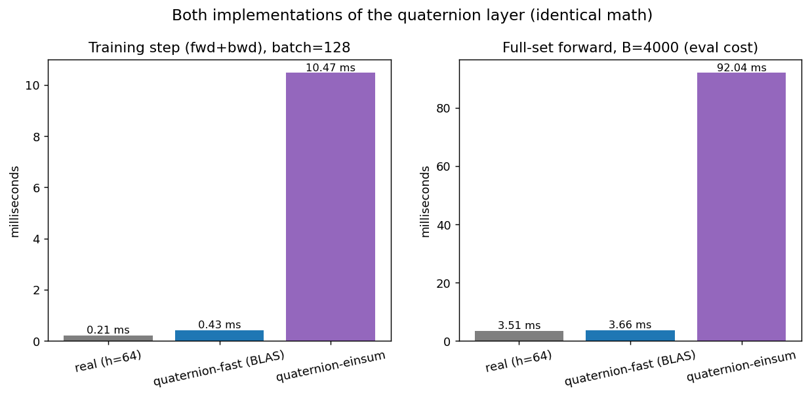
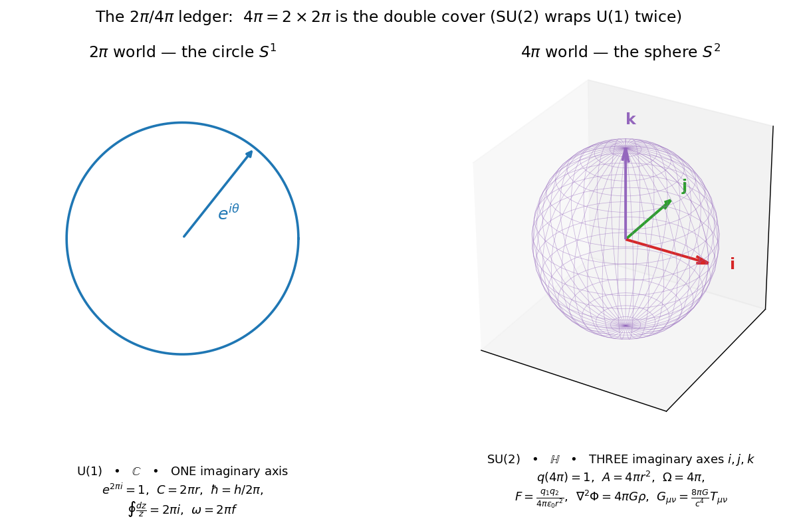
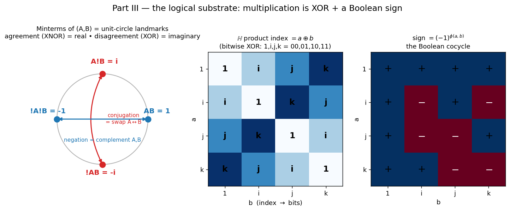
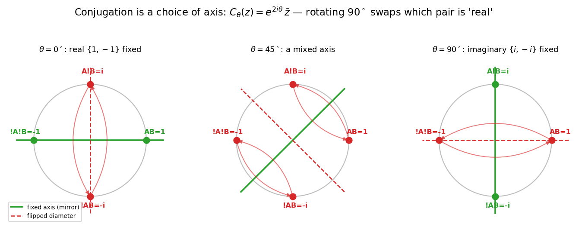
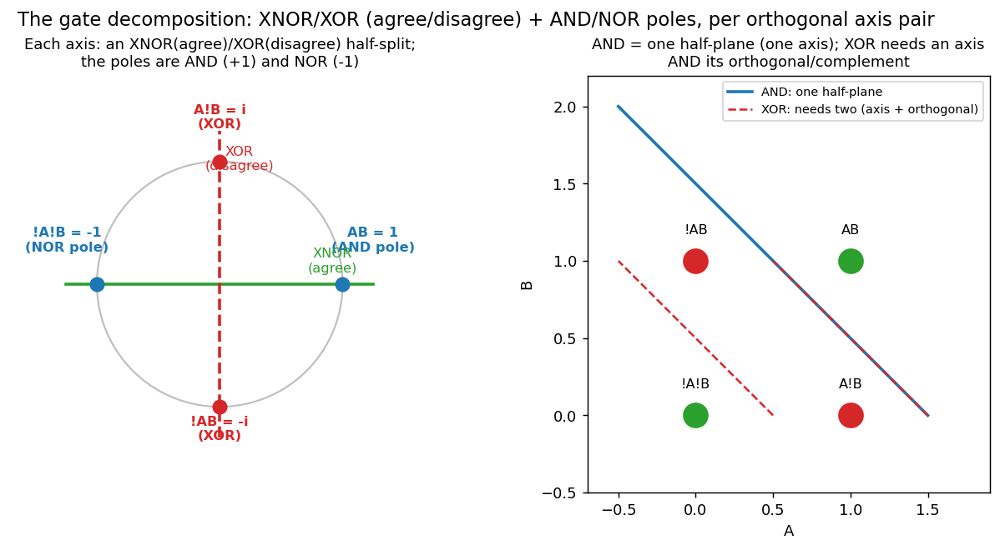
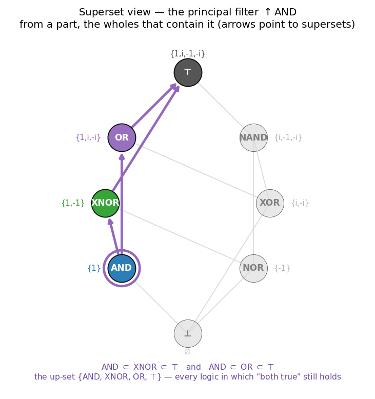
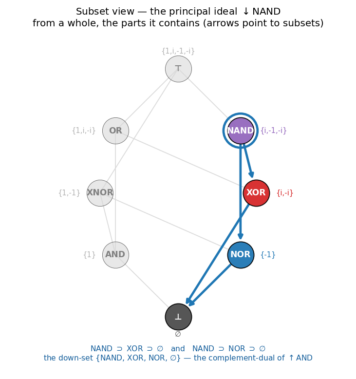
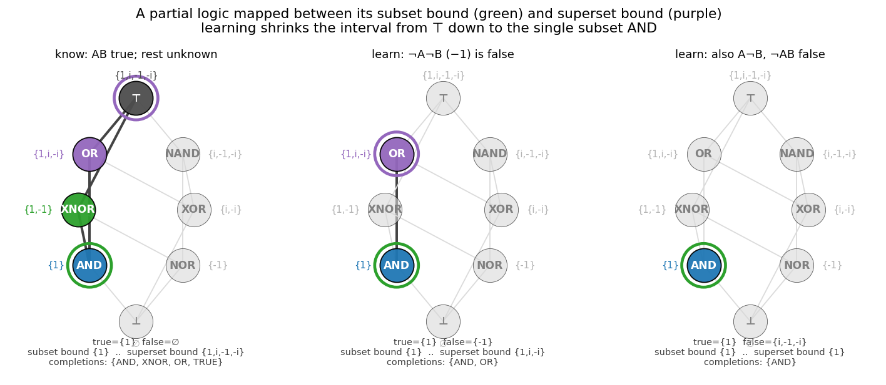
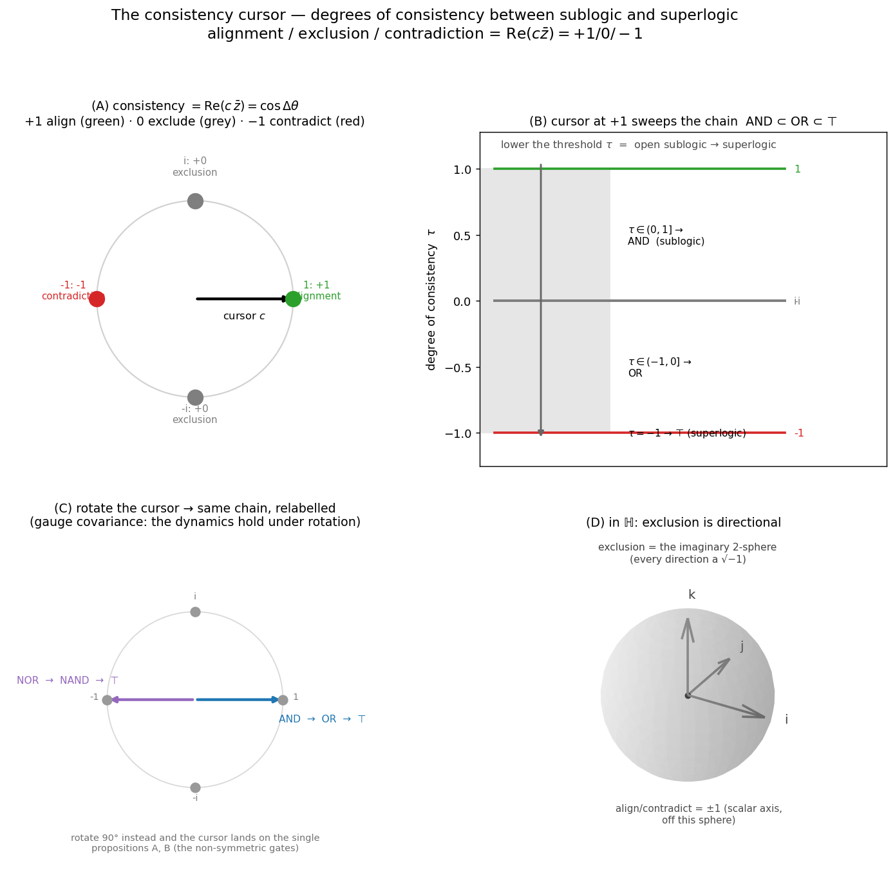

# Experiments — three threads

Working notes (not the paper). Each thread is a self-contained, reproducible
experiment. Run:

```bash
python src/spinor.py     # Thread 1 -> figures/fig9_spinor.png
python src/dirac.py      # Thread 2 -> figures/fig10_dirac.png
python src/qnn.py        # Thread 3 -> figures/fig11..fig14
python src/ledger.py     # Thread 4 -> figures/fig15_ledger.png
python src/logic.py      # Thread 5 -> figures/fig16..fig22 (logic, rotation, gates, lattice maps, cursor)
```

---

## Thread 1 — the 2π / 4π doubling (`src/spinor.py`)

**Claim.** The complex circle is 2π-periodic; quaternions are 4π-periodic, and the
phase functional `σ` reads the *half* angle. This is the double cover
SU(2) → SO(3) — the same fact as your "−1 ↔ π", seen from the rotation side.

A rotation by φ about axis **n** is `q(φ) = cos(φ/2) + n·sin(φ/2)` (half-angle).

| check | result |
|---|---|
| `q(2π) = −1` | err 1.2e-16 |
| `q(4π) = +1` | err 2.4e-16 |
| `R_q = R_{−q}` (q and −q rotate space identically) | err 0 (exact) |
| vector returns to start after 2π | err 2.4e-16 |

**Finding.** Confirmed exactly. The spinor needs **4π** to return to identity; its
action on space returns after **2π**. `σ(q(φ)) = (φ/2)·n` — the half-angle is where
your `2π → 4π` factor lives.


---

## Thread 2 — the Cayley table is the atomic cell of Dirac (`src/dirac.py`)

**Claim (refined).** The quaternion units *are* the Pauli matrices
(`1→I, i→−iσx, j→−iσy, k→−iσz`), an algebra isomorphism ℍ ≅ 𝔰𝔲(2). The Dirac
algebra of spacetime is `Cl(1,3) ≅ M₂(ℍ)` — 2×2 matrices over the quaternions. So
the Cayley table isn't *more complete* than Dirac; it's the **2×2 building block
Dirac is assembled from**.

| check | result |
|---|---|
| quaternion → Pauli homomorphism `mat(a⊗b)=mat(a)mat(b)` | err 4.4e-15 |
| unit quaternions are SU(2) (`UU† = I`) | err 8.0e-16 |
| `det U = 1` | err 6.8e-16 |
| Dirac Clifford relation `{γμ,γν} = 2ημν` | err 0 (exact) |
| recovered metric `η` | `diag(+1,−1,−1,−1)` |

**Finding.** Confirmed. The Minkowski metric `diag(+,−,−,−)` falls out of the
anticommutator of gammas built from quaternion (Pauli) blocks.


---

## Thread 3 — can the architecture learn, in isolation? (`src/qnn.py`)

A from-scratch quaternion MLP (Hamilton-product linear layers + split-tanh),
pure NumPy, manual backprop. **Gradient check vs finite differences: 5.3e-10** —
backprop is correct. No RoPE, no transformer.

### 3a. It learns — task `p' = r ⊗ p ⊗ r*` (learn the rotation action)

| model | params | test MSE | R² |
|---|---|---|---|
| quaternion MLP | 1348 | 3.2e-2 | **0.897** |
| real MLP (matched) | 1399 | 6.6e-3 | — |
| mean predictor | — | 2.6e-1 | 0 |

**Finding — honest.** The quaternion net **learns** (R²=0.90, ~8× better than the
mean predictor). But on this *dense* task a parameter-matched real MLP does
**better** (MSE 6.6e-3 vs 3.2e-2). Why: the rotation *sandwich* `r p r*` is not
naturally a chain of left-multiplications, so the Hamilton prior is a poor fit
here. Quaternion nets are **not** universally superior — and we should say so.


### 3b. Where the prior actually pays — sample efficiency on quaternion-native data

Task `y = Q ⊗ x + noise` for fixed unknown `Q`. The quaternion layer (4 DOF) has
*exactly* the right structure; the real layer (16 DOF) must estimate it.

| train samples | quaternion MSE | real MSE | quaternion advantage |
|---:|---|---|---:|
| 8   | 0.0058 | 0.0473 | **8.2×** |
| 16  | 0.0027 | 0.0123 | 4.6× |
| 32  | 0.0012 | 0.0040 | 3.3× |
| 64  | 0.0008 | 0.0018 | 2.3× |
| 128 | 0.0005 | 0.0011 | 2.2× |
| 256 | 0.0002 | 0.0005 | 2.5× |

**Finding.** When the data really is quaternion-structured, the Hamilton prior
generalises from **far fewer samples** (8× at N=8), with the gap narrowing as data
grows — the signature of a correct, restrictive inductive bias.


### 3c. True apples-to-apples on `p' = r ⊗ p ⊗ r*` (steps-to-threshold + efficiency)

A quaternion hidden layer of width H quaternions carries 4H real activations, so
there are two honest real baselines: **param-matched** (same scalar count, narrower
real net) and **capacity-matched** (same real hidden dimension 4H, ~4× the params).
Capacity-matching isolates the *prior* alone — the quaternion net is exactly a real
net of that dimension with weights constrained to the Hamilton block form.

| model | params | wall-clock† | final MSE | steps→0.10 | →0.05 | →0.03 |
|---|---:|---:|---:|---:|---:|---:|
| quaternion (H=16, 64-dim) | 1348 | 4.6 s | 0.0170 | 2175 | 3100 | 4150 |
| real param-matched (h=31) | 1399 | 2.1 s | 0.0038 | 300 | 425 | 575 |
| real capacity-matched (h=64) | 4996 | 3.6 s | 0.0015 | 175 | 250 | 300 |

†optimised BLAS layer (§3d); the einsum layer gives the identical result in 97 s.

**Finding — the important corrective.** On the rotation *sandwich* `r p r*`, the
quaternion MLP is **worse on every axis**: ~7× more steps to each accuracy
threshold, higher final error, and far slower wall-clock. Two causes, kept
separate:

- **Representational:** the sandwich `r p r*` is conjugation, not a chain of
  left-multiplications, so the Hamilton-block prior is the *wrong* prior here — it
  underfits (plateaus ~0.017 where the real net reaches 0.0015).
- **Implementation:** the wall-clock gap (97 s vs 2–4 s) is partly an artifact —
  the pure-NumPy einsum layer plus frequent full-set evaluation is unoptimised;
  steps-to-threshold is the fairer efficiency metric, and it *also* favours the
  real net on this task.

So the quaternion prior is **not** a free efficiency win. It helps only when it is
the *correct* prior — which is exactly what 3b isolates.


### 3d. Both implementations of the layer (einsum vs BLAS)

The Hamilton product is bilinear: `w ⊗ x = L(w)·x`. The naive layer uses a per-sample
einsum; the optimised layer assembles the block matrix once and uses one BLAS matmul.
They are **bit-for-bit identical** (forward/dX/dW agree to ~1e-15), so learning curves
and steps-to-threshold are unchanged — only wall-clock differs.

| layer | train step (B=128) | full forward (B=4000) |
|---|---:|---:|
| real (h=64) | 0.21 ms | 3.51 ms |
| quaternion — BLAS | 0.40 ms | 3.69 ms |
| quaternion — einsum | 10.44 ms | 91.75 ms |

**Finding.** The naive layer is ~26× slower; the optimised layer is within ~2× of a
real layer of the same hidden dimension (comparable FLOPs). The 97 s wall-clock in 3c
was implementation, not algebra — a quaternion layer is not inherently expensive.



---

## Thread 4 — the 2π/4π ledger (`src/ledger.py`)

**Claim.** `2π` and `4π` across math/physics are the same circle→sphere step the
framework is built on. `2π` = measure of the circle `S¹` (`U(1)`, ℂ, one imaginary
axis); `4π` = measure of the sphere `S²` (`SU(2)`, ℍ, three axes `i,j,k`).

| geometric root | value | = |
|---|---|---|
| circle circumference | 6.283 | 2π |
| sphere area / solid angle | 12.566 | 4π |
| Gauss–Bonnet `∫_{S²} K dA` (χ=2) | 12.566 | 4π |
| Gauss flux recovers enclosed charge | 1.000 | q |
| ratio sphere/circle | 2.000 | the double cover |

**Finding.** The `4π` of Coulomb / Gauss / Poisson / Einstein (`8π`) is a source
spreading through the enclosing 2-sphere; the `2π` of Fourier / Cauchy / `ħ` is the
`U(1)` circle. The spinor `q(4π)=1` is the same `4π`, now as the `SU(2)` double cover.
`4π = 2·2π` is that doubling.



---

## Thread 5 — the logical substrate (`src/logic.py`)

**Claim.** The framework's "logic" is literally Boolean. The 4 unit-circle landmarks
are the 4 minterms of two Booleans `A,B`:

| minterm | agree? | landmark |
|---|---|---|
| `AB` | XNOR | `1` |
| `A!B` | XOR | `i` |
| `!A!B` | XNOR | `-1` |
| `!AB` | XOR | `-i` |

So `{A!B, !AB}` (disagreement) are the **conjugates** = imaginary `{i,−i}`, and
`{AB, !A!B}` (agreement) are the **complements/composites** = real `{1,−1}`.

| identity | residual |
|---|---|
| swap `A↔B` == complex conjugation | 0 (exact) |
| complement both == negation (antipode) | 0 (exact) |
| `XOR(A,B)` == imaginary grade | 0 (exact) |
| grade adds via XOR under multiplication | 0 (exact) |
| ℍ: product index `= a ⊕ b` (bitwise XOR) | 0 violations |
| ℍ: conjugation is a Boolean function of the index | 0 violations |

The ℍ index table is the abelian Klein-four XOR group; **all** non-commutativity lives
in the Boolean sign cocycle `φ` (`e_a·e_b = (−1)^{φ(a,b)} e_{a⊕b}`).



**Rotation (any angle).** The conjugate/composite split is a choice of axis:
`C_θ(z) = e^{2iθ} z̄` fixes the diameter at angle θ and flips the perpendicular one.
At θ=0 the real pair `{1,−1}` is fixed; at **θ=90° the roles swap** (`{i,−i}` fixed,
`{1,−1}` flipped); a generic θ fixes neither. All verified to ~1e-16. Composing two
reflections is a rotation → the conjugations form a circle (`U(1)` covariance), the
continuous completion of the discrete Boolean swap.



**Gate decomposition (the "half/half").** Through the symmetric two-input gates (all
exact): **XNOR** = agreement = real axis `{1,−1}` (half); **XOR** = disagreement =
imaginary axis `{i,−i}` (half); the agreement poles are **AND** (`+1`, both true) and
**NOR** (`−1`, both false), with output-complements NAND/OR. AND/NAND/OR/NOR are each
a single half-plane (one axis); **XOR/XNOR are not** — they need an axis *and* its
orthogonal/complement. Rotating 90° swaps the XNOR/XOR halves and moves the poles. So
per orthogonal axis pair: half agreement (XNOR + AND/NOR poles), half disagreement
(XOR).



**Whole/part lattice — two maps + a data structure (0 violations, 12/12 checks).** The
gates form one inclusion lattice drawn in two directions. The **superset map** is the
principal filter `↑AND = {AND, XNOR, OR, ⊤}` (from a part, the wholes that contain it);
the **subset map** is the principal ideal `↓NAND = {NAND, XOR, NOR, ∅}` (from a whole,
the parts it contains). They are complement-dual: `S ⊇ AND ⇔ Sᶜ ⊆ NAND`, node-for-node.




The lattice is a reusable data structure (`Logic`, `GateLattice`, `PartialLogic`). A
`PartialLogic` marks each landmark known-true / known-false / unknown and denotes the
interval `[known-true (subset bound), all∖known-false (superset bound)]`; its
`completions` are the gates in between. Learning facts walks it from ⊤ down to a single
subset:

| step | known-true | known-false | subset bound | superset bound | completions |
|---|---|---|---|---|---|
| start | `{1}` | `∅` | AND `{1}` | ⊤ `{1,i,−1,−i}` | AND, XNOR, OR, ⊤ |
| ¬A¬B false | `{1}` | `{−1}` | AND `{1}` | OR `{1,i,−i}` | AND, OR |
| A¬B, ¬AB false | `{1}` | `{−1,i,−i}` | AND `{1}` | AND `{1}` | AND |



**Consistency cursor — alignment / exclusion / contradiction (0 violations).** A cursor is
a unit direction `c`; the consistency of a landmark is `κ(z|c) = Re(c·z̄) = cosΔθ`, with
`+1` alignment, `0` exclusion, `−1` contradiction. Thresholding at `τ` and lowering it
sweeps a monotone chain from the tight **sublogic** (AND) up to the full **superlogic**
(⊤): `AND ⊂ OR ⊂ ⊤` (cursor on `+1`), `NOR ⊂ NAND ⊂ ⊤` (rotated to `−1`). Exact findings:

| check | result |
|---|---|
| cursor level-sets (one half-plane) == linearly-separable gates | True (all 6) |
| every τ-sweep is a nested chain ending at ⊤ | True |
| rotating the cursor preserves the pairwise-relation multiset | True |
| both layouts (minterm map; contrast map A=−1,B=+1,AB=i,¬A¬B=−i) share it | True |
| relational quaternion `R=p·q̄`: R(1,1)=+1, R(1,−1)=−1, R(i,1) imaginary | True |
| exclusion is directional (i,j,k distinct axes); pure exclusion `R²=−1` | True |

So the cursor-thresholdable gates are *exactly* the separable ones (parity needs two
cursors), rotation is a free gauge, and at the quaternion level exclusion gains a
direction — the exclusion relations *are* the unit imaginaries (√−1).



---

## Honest summary

- **Thread 1 (2π/4π):** real and exact; the deepest of the three. The half-angle
  /double-cover is the genuinely non-trivial structure.
- **Thread 2 (Dirac):** real; the quaternion Cayley table is the atomic cell of the
  Dirac algebra (`Cl(1,3) ≅ M₂(ℍ)`), not a superset of it.
- **Thread 3 (learning):** the architecture **does** learn in isolation
  (verified backprop). On a true apples-to-apples test (3c) it is *worse* than a
  real net on the rotation-sandwich task — wrong prior. But on quaternion-native
  data (3b) the Hamilton prior is markedly more **sample-efficient** (8× at N=8).
  The advantage is real but **conditional**: it appears only when the data truly
  has the multiplicative quaternion structure the prior encodes. Both layer
  implementations are proven identical; the optimised one is ~26× faster (the 97 s
  wall-clock was an artifact).
- **Thread 4 (2π/4π ledger):** the constants are the circle (`2π`, ℂ, `U(1)`) vs the
  sphere (`4π`, ℍ, `SU(2)`); `4π = 2·2π` is the double cover. Physics reaches for
  `4π` when a quantity spreads through 3-D space (flux laws) or carries half-integer
  spin.
- **Thread 5 (logical substrate):** the whole thing is Boolean logic on the circle —
  minterms = landmarks, agreement/disagreement = real/imaginary, conjugation = swap,
  negation = complement, multiplication = XOR + Boolean sign, and the "real" axis is a
  free `U(1)` choice. This closes the loop back to the framework's opening "logic."

**Open question for the paper's thesis:** the strongest, most defensible claim
emerging from these experiments is *not* "quaternions beat real nets," but
"**the 2π→4π / SU(2) structure is a correct and sample-efficient inductive bias for
data with rotational/spinorial structure**." That ties Thread 1 (the structure),
Thread 2 (why it's the right algebra), and Thread 3b (it measurably helps) into one
line — without overclaiming.
