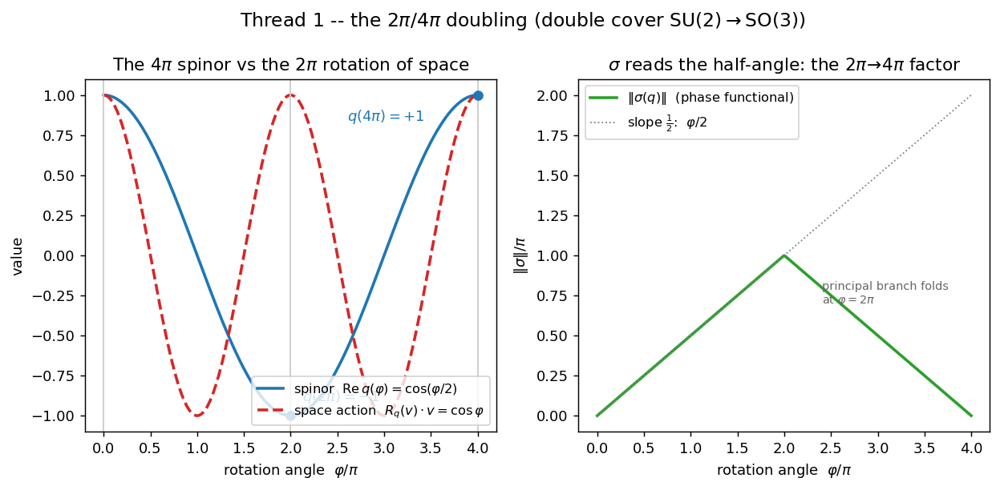
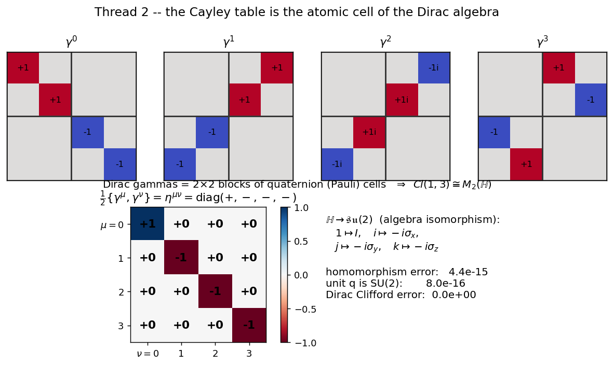
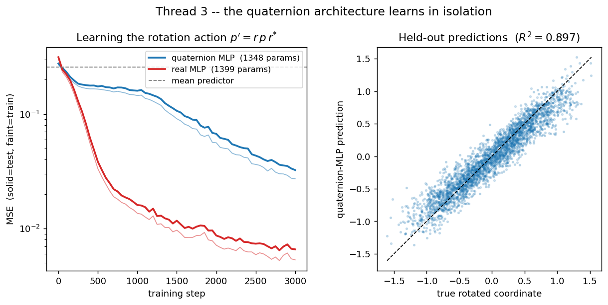
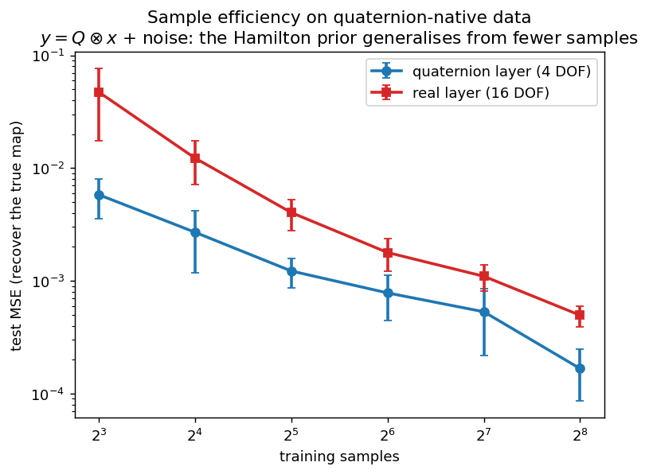
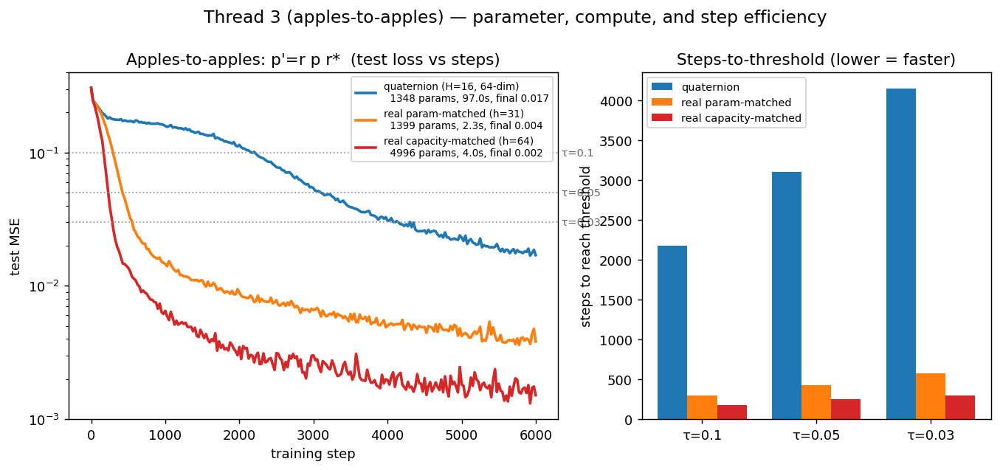

# Experiments — three threads

Working notes (not the paper). Each thread is a self-contained, reproducible
experiment. Run:

```bash
python src/spinor.py     # Thread 1 -> figures/fig9_spinor.png
python src/dirac.py      # Thread 2 -> figures/fig10_dirac.png
python src/qnn.py        # Thread 3 -> figures/fig11_learning.png, fig12_sample_efficiency.png
```

---

## Thread 1 — the 2π / 4π doubling (`src/spinor.py`)

**Claim.** The complex circle is 2π-periodic; quaternions are 4π-periodic, and the
phase functional `σ` reads the *half* angle. This is the double cover
SU(2) → SO(3) — the same fact as your "−1 ↔ π", seen from the rotation side.

A rotation by φ about axis **n** is `q(φ) = cos(φ/2) + n·sin(φ/2)` (half-angle).

| check | result |
|---|---|
| `q(2π) = −1` | err 1.2e-16 |
| `q(4π) = +1` | err 2.4e-16 |
| `R_q = R_{−q}` (q and −q rotate space identically) | err 0 (exact) |
| vector returns to start after 2π | err 2.4e-16 |

**Finding.** Confirmed exactly. The spinor needs **4π** to return to identity; its
action on space returns after **2π**. `σ(q(φ)) = (φ/2)·n` — the half-angle is where
your `2π → 4π` factor lives.



---

## Thread 2 — the Cayley table is the atomic cell of Dirac (`src/dirac.py`)

**Claim (refined).** The quaternion units *are* the Pauli matrices
(`1→I, i→−iσx, j→−iσy, k→−iσz`), an algebra isomorphism ℍ ≅ 𝔰𝔲(2). The Dirac
algebra of spacetime is `Cl(1,3) ≅ M₂(ℍ)` — 2×2 matrices over the quaternions. So
the Cayley table isn't *more complete* than Dirac; it's the **2×2 building block
Dirac is assembled from**.

| check | result |
|---|---|
| quaternion → Pauli homomorphism `mat(a⊗b)=mat(a)mat(b)` | err 4.4e-15 |
| unit quaternions are SU(2) (`UU† = I`) | err 8.0e-16 |
| `det U = 1` | err 6.8e-16 |
| Dirac Clifford relation `{γμ,γν} = 2ημν` | err 0 (exact) |
| recovered metric `η` | `diag(+1,−1,−1,−1)` |

**Finding.** Confirmed. The Minkowski metric `diag(+,−,−,−)` falls out of the
anticommutator of gammas built from quaternion (Pauli) blocks.



---

## Thread 3 — can the architecture learn, in isolation? (`src/qnn.py`)

A from-scratch quaternion MLP (Hamilton-product linear layers + split-tanh),
pure NumPy, manual backprop. **Gradient check vs finite differences: 5.3e-10** —
backprop is correct. No RoPE, no transformer.

### 3a. It learns — task `p' = r ⊗ p ⊗ r*` (learn the rotation action)

| model | params | test MSE | R² |
|---|---|---|---|
| quaternion MLP | 1348 | 3.2e-2 | **0.897** |
| real MLP (matched) | 1399 | 6.6e-3 | — |
| mean predictor | — | 2.6e-1 | 0 |

**Finding — honest.** The quaternion net **learns** (R²=0.90, ~8× better than the
mean predictor). But on this *dense* task a parameter-matched real MLP does
**better** (MSE 6.6e-3 vs 3.2e-2). Why: the rotation *sandwich* `r p r*` is not
naturally a chain of left-multiplications, so the Hamilton prior is a poor fit
here. Quaternion nets are **not** universally superior — and we should say so.



### 3b. Where the prior actually pays — sample efficiency on quaternion-native data

Task `y = Q ⊗ x + noise` for fixed unknown `Q`. The quaternion layer (4 DOF) has
*exactly* the right structure; the real layer (16 DOF) must estimate it.

| train samples | quaternion MSE | real MSE | quaternion advantage |
|---:|---|---|---:|
| 8   | 0.0058 | 0.0473 | **8.2×** |
| 16  | 0.0027 | 0.0123 | 4.6× |
| 32  | 0.0012 | 0.0040 | 3.3× |
| 64  | 0.0008 | 0.0018 | 2.3× |
| 128 | 0.0005 | 0.0011 | 2.2× |
| 256 | 0.0002 | 0.0005 | 2.5× |

**Finding.** When the data really is quaternion-structured, the Hamilton prior
generalises from **far fewer samples** (8× at N=8), with the gap narrowing as data
grows — the signature of a correct, restrictive inductive bias.



### 3c. True apples-to-apples on `p' = r ⊗ p ⊗ r*` (steps-to-threshold + efficiency)

A quaternion hidden layer of width H quaternions carries 4H real activations, so
there are two honest real baselines: **param-matched** (same scalar count, narrower
real net) and **capacity-matched** (same real hidden dimension 4H, ~4× the params).
Capacity-matching isolates the *prior* alone — the quaternion net is exactly a real
net of that dimension with weights constrained to the Hamilton block form.

| model | params | wall-clock | final MSE | steps→0.10 | →0.05 | →0.03 |
|---|---:|---:|---:|---:|---:|---:|
| quaternion (H=16, 64-dim) | 1348 | 97.0 s | 0.0170 | 2175 | 3100 | 4150 |
| real param-matched (h=31) | 1399 | 2.3 s | 0.0038 | 300 | 425 | 575 |
| real capacity-matched (h=64) | 4996 | 4.0 s | 0.0015 | 175 | 250 | 300 |

**Finding — the important corrective.** On the rotation *sandwich* `r p r*`, the
quaternion MLP is **worse on every axis**: ~7× more steps to each accuracy
threshold, higher final error, and far slower wall-clock. Two causes, kept
separate:

- **Representational:** the sandwich `r p r*` is conjugation, not a chain of
  left-multiplications, so the Hamilton-block prior is the *wrong* prior here — it
  underfits (plateaus ~0.017 where the real net reaches 0.0015).
- **Implementation:** the wall-clock gap (97 s vs 2–4 s) is partly an artifact —
  the pure-NumPy einsum layer plus frequent full-set evaluation is unoptimised;
  steps-to-threshold is the fairer efficiency metric, and it *also* favours the
  real net on this task.

So the quaternion prior is **not** a free efficiency win. It helps only when it is
the *correct* prior — which is exactly what 3b isolates.



---

## Honest summary

- **Thread 1 (2π/4π):** real and exact; the deepest of the three. The half-angle
  /double-cover is the genuinely non-trivial structure.
- **Thread 2 (Dirac):** real; the quaternion Cayley table is the atomic cell of the
  Dirac algebra (`Cl(1,3) ≅ M₂(ℍ)`), not a superset of it.
- **Thread 3 (learning):** the architecture **does** learn in isolation
  (verified backprop). On a true apples-to-apples test (3c) it is *worse* than a
  real net on the rotation-sandwich task — wrong prior. But on quaternion-native
  data (3b) the Hamilton prior is markedly more **sample-efficient** (8× at N=8).
  The advantage is real but **conditional**: it appears only when the data truly
  has the multiplicative quaternion structure the prior encodes.

**Open question for the paper's thesis:** the strongest, most defensible claim
emerging from these experiments is *not* "quaternions beat real nets," but
"**the 2π→4π / SU(2) structure is a correct and sample-efficient inductive bias for
data with rotational/spinorial structure**." That ties Thread 1 (the structure),
Thread 2 (why it's the right algebra), and Thread 3b (it measurably helps) into one
line — without overclaiming.
