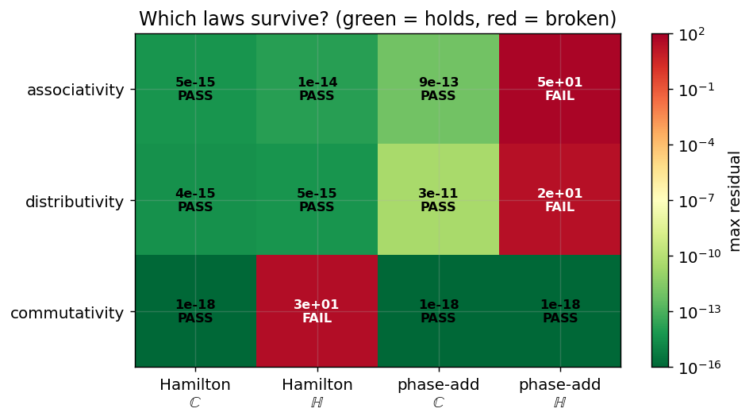

# Quaternions Are All You Need

Empirical evidence and proofs that the *realised-imaginary* framework —
energy $e(\cdot)$, phase $\sigma(\cdot)$, and the involution
$e(x)=e(y)\Leftrightarrow\sigma(x)=-\sigma(y)$ — is **associative**,
**distributive**, and **non-contradictory** under the Hamilton product, and
that the naive *phase-additive* alternative breaks associativity and
distributivity the moment it leaves the complex plane.

> **Thesis.** Extending the imaginaries from one direction (the complex unit
> circle, where $1\leftrightarrow 0$ and $-1\leftrightarrow\pi$) to three
> ($i,j,k$), *something* must give. Add phases and you keep commutativity but
> lose associativity + distributivity; use the Hamilton product and you keep
> associativity + distributivity, losing only commutativity. By Frobenius's
> theorem that tradeoff is forced — so **quaternions are all you need**.

## The paper

[`paper/paper.md`](paper/paper.md) — full write-up with definitions, theorems,
proofs, methodology, results, and all figures.

## Quick start

```bash
pip install -r requirements.txt
python src/verification.py     # Monte-Carlo residual table -> results/metrics.json
python src/plots.py            # all figures -> figures/
```

## Results at a glance

Maximum residual over $2\times10^4$ random trials (machine precision $\approx10^{-15}$):

| law | Hamilton / ℂ | Hamilton / ℍ | phase-add / ℂ | phase-add / ℍ |
|---|---|---|---|---|
| associativity  | 5.4e-15 | 1.4e-14 | 9.1e-13 | **5.4e+01** |
| distributivity | 3.6e-15 | 5.3e-15 | 3.5e-11 | **2.3e+01** |
| commutativity  | 0 | **3.0e+01** | 0 | 0 |

Bold = law broken. All non-contradiction identities ($i^2=j^2=k^2=ijk=-1$,
$qq^{*}=|q|^2$, $e(q^{*})=e(q)$, $\sigma(q^{*})=-\sigma(q)$) hold to machine
precision or exactly.



## Experiments (three threads)

See [`EXPERIMENTS.md`](EXPERIMENTS.md). Honest findings, not the paper.

```bash
python src/spinor.py   # Thread 1: the 2pi/4pi doubling (double cover SU(2)->SO(3))
python src/dirac.py    # Thread 2: the Cayley table is the atomic cell of Dirac (Cl(1,3)=M2(H))
python src/qnn.py      # Thread 3: a from-scratch quaternion MLP that learns (grad-checked)
python src/ledger.py   # Thread 4: the 2pi/4pi ledger across math & physics
python src/logic.py    # Thread 5: the Boolean substrate (minterms = circle, XOR = product)
```

- **Thread 1** — `q(2π)=−1`, `q(4π)=+1`, exact; `σ` reads the half-angle.
- **Thread 2** — ℍ ≅ 𝔰𝔲(2); Dirac gammas are 2×2 quaternion blocks; metric `diag(+,−,−,−)` recovered.
- **Thread 3** — quaternion MLP learns (backprop verified to 5e-10). A **true
  apples-to-apples** test (param- and capacity-matched, steps-to-threshold) shows it
  is *worse* than a real net on the rotation-sandwich task (~7× more steps) — wrong
  prior — but **8× more sample-efficient** on quaternion-native data. Both layer
  implementations (einsum vs BLAS) are proven identical; the optimised one is ~26×
  faster and within ~2× of a real layer (the 97s wall-clock was an artifact).
- **Thread 4** — `2π` = the circle/`U(1)`/ℂ (one imaginary axis); `4π` = the
  sphere/`SU(2)`/ℍ (three axes `i,j,k`). The same circle→sphere step explains `4π`
  in Coulomb, Gauss, Poisson, Einstein (`8π`) and the spinor `q(4π)=1`.
- **Thread 5** — the logical substrate. The 4 unit-circle landmarks are the 4
  minterms of two Booleans: agreement (XNOR) = real `{1,−1}`, disagreement (XOR) =
  imaginary `{i,−i}`. Conjugation = swap `A↔B`, negation = complement both, and
  multiplication = bitwise XOR of basis indices + a Boolean sign. The "real" axis is a
  free `U(1)` choice — rotating 90° swaps the pairs. All verified to machine precision.

## Layout

```
src/framework.py      core algebra (Hamilton & phase-additive operators, e, sigma, exp/log)
src/verification.py   Monte-Carlo law-residual + non-contradiction suite
src/plots.py          paper figures fig1..fig8
src/spinor.py         Thread 1 experiment -> fig9
src/dirac.py          Thread 2 experiment -> fig10
src/qnn.py            Thread 3 quaternion neural net (einsum+BLAS layers) -> fig11..fig14
src/ledger.py         Thread 4 the 2pi/4pi ledger -> fig15
src/logic.py          Thread 5 the Boolean substrate -> fig16, fig17
paper/paper.md        the paper (DRAFT) — Part I algebra, II structure & learning, III logic
EXPERIMENTS.md        experiment writeup / findings
figures/              generated figures
results/              metrics.json, learning.json
```
