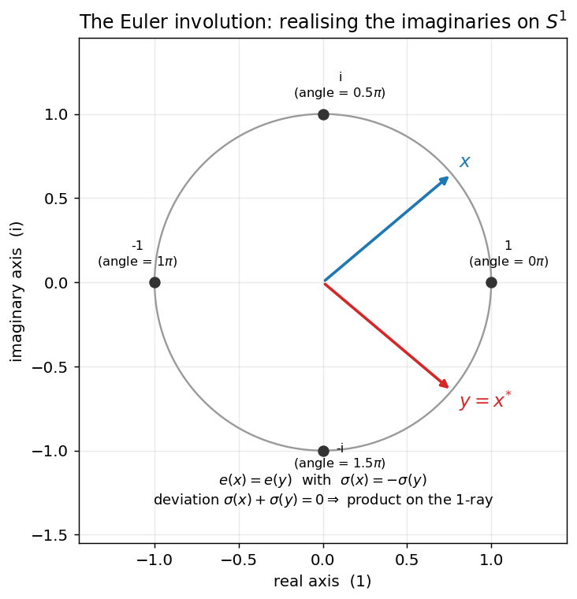
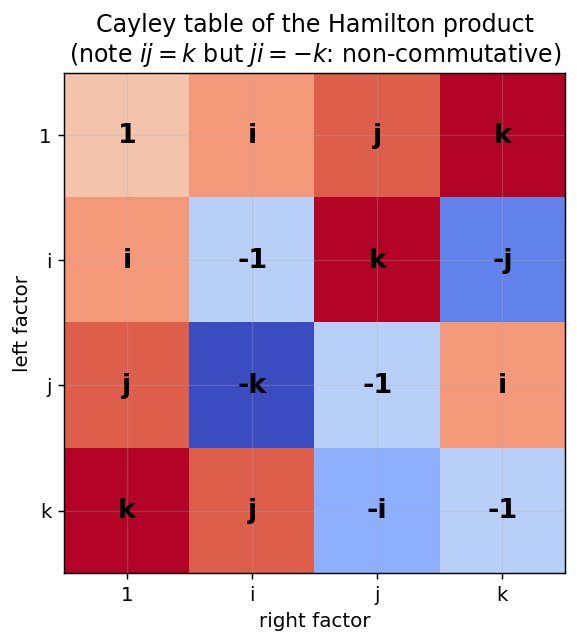
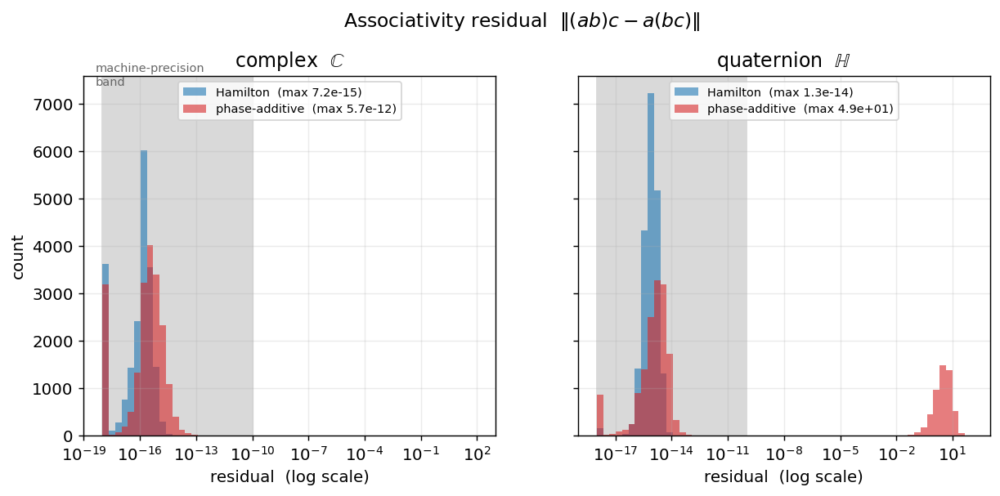
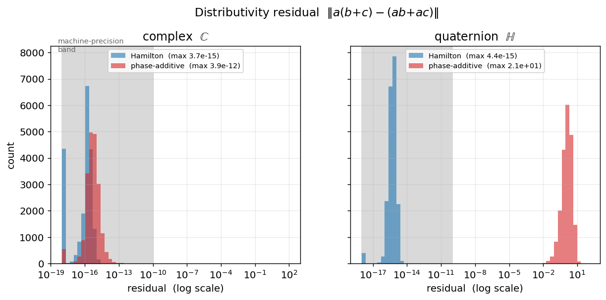
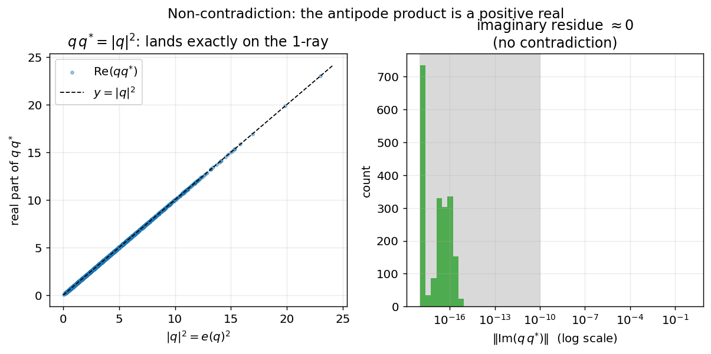
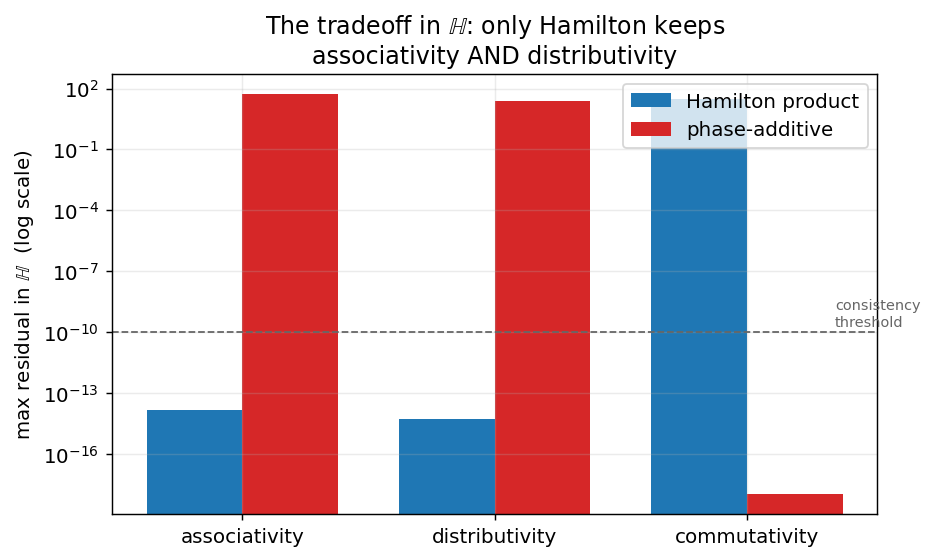
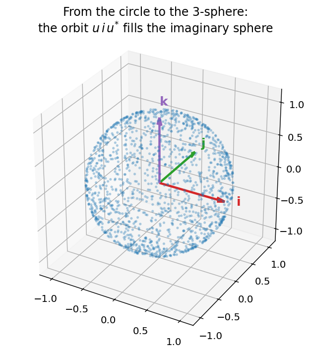
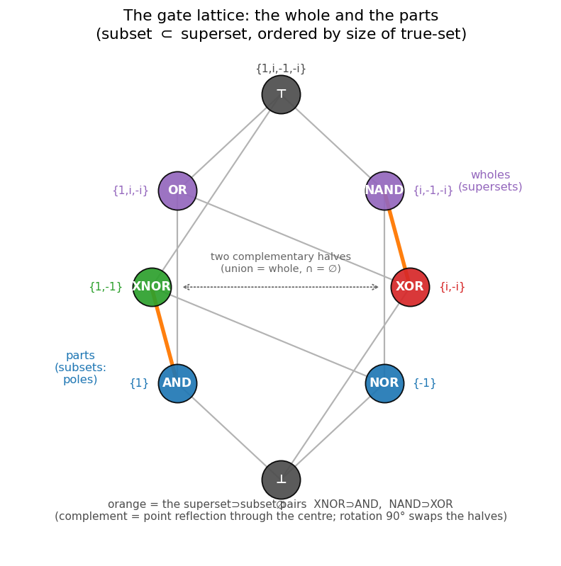

# Quaternions Are All You Need

### Associativity, Distributivity, and Non-Contradiction of the Realised-Imaginary Framework

**Richard I Christopher** &nbsp;·&nbsp; [rchris@neotec.dev](mailto:rchris@neotec.dev)

*Draft — work in progress.*

**Abstract.** Descartes named them *imaginary* and Euler made them turn: numbers
that carry both magnitude *and* direction, neither of which a single real number
can hold. We formalise this intuition as a small framework built on two
functionals — an *energy* $e(\cdot)$ and a *phase* $\sigma(\cdot)$ — governed by a
single involution, $e(x)=e(y)$ whenever $\sigma(x)=-\sigma(y)$, realised
concretely by conjugation. On the complex unit circle the framework is exact: the
point $1$ sits at phase $0$ and the point $-1$ at phase $\pi$, and the naive rule
"multiply by adding phases" is associative, commutative and distributive. We then
ask what survives when the single imaginary axis is extended to the three axes
$i,j,k$. We prove, and confirm empirically over $2\times10^{4}$ Monte-Carlo trials,
that the naive phase-additive rule **breaks associativity and distributivity** in
four dimensions, while the **Hamilton product preserves associativity,
distributivity and non-contradiction** — at the sole cost of commutativity. The
quaternions are not one option among many for realising the imaginaries in higher
dimension; up to the laws we demand, they are the only one. We then extend the
study in three directions: the $2\pi\!\to\!4\pi$ doubling (the double cover
SU(2)$\to$SO(3), where $\sigma$ reads the half-angle), which we trace through the key
$2\pi$/$4\pi$ equations of mathematics and physics — circle vs. sphere, $U(1)$ vs.
$SU(2)$; the observation that the Cayley table is the *atomic cell* of the Dirac
algebra ($Cl(1,3)\cong M_2(\mathbb{H})$);
and a from-scratch quaternion neural network, where a **true apples-to-apples**
study finds the Hamilton prior is *not* a universal win — it underperforms a real
network on tasks it does not fit, but is markedly more **sample-efficient** when
the data genuinely carries multiplicative quaternion structure. Finally we expose the
**logical substrate**: the four landmarks of the unit circle are the four minterms of
two Boolean variables (agreement $=$ real, disagreement $=$ imaginary), conjugation is
the swap $A\leftrightarrow B$ and negation the joint complement, and multiplication is
bitwise XOR of the basis indices dressed with a Boolean sign — the choice of "real"
axis being a free $U(1)$ rotation. *Quaternions are all you need — for the algebra; for
learning, only when the structure is; and underneath, it is all Boolean logic on the
circle.*

---

## 1. Introduction

When Descartes coined "imaginary" he meant it dismissively: a quantity that
appears in the algebra but cannot be *realised* as a length on the number line.
Euler supplied the missing realisation. His identity

$$ e^{i\theta} = \cos\theta + i\sin\theta $$

does not place the imaginary unit *on* the real line; it places it *around* it.
The "unrealised" content of $i$ is exactly the content a real number is missing:
**direction**. A real number is a signed magnitude; a complex number is a magnitude
together with a phase. The imaginary axis is the bookkeeping device that lets a
single object carry both.

This paper takes that reading literally and asks a structural question. The
complex numbers realise *one* imaginary direction. Physical space has three. If we
insist on extending the construction so that magnitude and direction continue to
compose lawfully, **which algebraic laws can we keep, and which must we give up?**

We answer with both proof and measurement. **Part I** fixes the framework and
settles the algebra: Section 2 defines the two functionals $e$ and $\sigma$, the
governing involution, the Euler map, and the two candidate composition operators;
Section 3 states the three laws — associativity, distributivity, non-contradiction —
and proves the decisive theorems; Section 4 gives the numerical methodology and
Section 5 the results; Section 6 draws the algebraic conclusion. **Part II** asks what
the structure *is* and whether it *helps*: Section 7 the $2\pi\!\to\!4\pi$ doubling,
Section 8 the Dirac connection, Section 9 a from-scratch quaternion neural network
studied honestly, Section 10 the $2\pi/4\pi$ equation ledger across mathematics and
physics, Section 11 the Boolean logic beneath the whole construction, and Section 12
the synthesis, limitations, and future work.

The framing is deliberately layered. The geometric/philosophical reading (the
"realised imaginaries") is *motivation*; the theorems are *what is proven*; the
Monte-Carlo suite is *independent empirical confirmation* of the theorems on
pseudo-random inputs. We are explicit throughout about which is which.

### 1.1 Context and prior work

None of the underlying mathematics is new; the contribution is the unifying lens and
the honest empirical study. Quaternions are Hamilton's (1843); that
$\mathbb{R},\mathbb{C},\mathbb{H}$ are the only finite-dimensional associative real
division algebras is Frobenius's theorem (1878); the realisation of phase is Euler's.
The map $\mathbb{H}\cong\mathfrak{su}(2)$ to the Pauli matrices (Pauli, 1927) and the
assembly of the Dirac operator (Dirac, 1928) from these cells are standard Clifford-
algebra facts (Clifford, 1878). The $4\pi$ periodicity of spinors — the double cover
$\mathrm{SU}(2)\to\mathrm{SO}(3)$ — is classical, and is the same content as the
framework's half-angle functional $\sigma$.

On the learning side, quaternion-valued neural networks are an established line
(e.g. Parcollet and collaborators' quaternion recurrent and convolutional networks,
and the survey literature), motivated as here by the Hamilton product's weight-
sharing. Our aim is not to introduce the architecture but to test it *honestly* in
isolation — with a true apples-to-apples baseline, steps-to-threshold, and a
documented optimised implementation — and to report where the prior helps and where
it does not. (Rotary position embeddings, Su et al. 2021, are the complex-circle
special case of the same phase idea; we deliberately do not build on them here, to
study the quaternion structure on its own.) *The bibliography in Appendix C is
preliminary and should be verified before any submission.*

---

## 2. The framework

### 2.1 Representation

A quaternion is written

$$ q = w + x\,i + y\,j + z\,k, \qquad (w,x,y,z)\in\mathbb{R}^4, $$

with real (scalar) part $w$ and imaginary (vector) part $\mathbf v=(x,y,z)$. The
complex numbers embed as the **$i$-plane** $\{\,y=z=0\,\}$. In code each quaternion
is the array `[w, x, y, z]` (`src/framework.py`).

### 2.2 Two functionals: energy and phase

We organise everything around two maps.

* **Energy** (the *realised* magnitude):
  $$ e(q) = |q| = \sqrt{w^2+x^2+y^2+z^2}. $$
* **Phase** (the *unrealised* direction), defined as the imaginary part of the
  quaternion logarithm. For $q=|q|\,(\cos\theta + \mathbf n\sin\theta)$ with unit
  axis $\mathbf n$,
  $$ \sigma(q) = \operatorname{Im}\log q = \theta\,\mathbf n \in \operatorname{span}\{i,j,k\}. $$

Energy answers "how much"; phase answers "which way, and how far around".

### 2.3 The governing involution

The single law that animates the framework is

$$ \boxed{\,e(x)=e(y)\quad\text{whenever}\quad \sigma(x)=-\sigma(y).\,} $$

Two elements of opposite phase carry equal energy. This is not an extra axiom to
be bolted on; it is realised by **conjugation** $q\mapsto q^{*}=w-x i-y j-z k$,
which negates the vector part and fixes the magnitude:

$$ e(q^{*})=e(q), \qquad \sigma(q^{*})=-\sigma(q). $$

We call the pair $(x,y)=(q,q^{*})$ *antipodal*. Their *phase deviation*
$\sigma(x)+\sigma(y)$ vanishes, and — as Section 3.3 shows — their product lands
exactly on the real $1$-ray.

### 2.4 The Euler map and its landmarks

Restricting to the $i$-plane, the Euler map $E(\theta)=\cos\theta + i\sin\theta$
sends phase angles to unit-circle points. Its landmarks are the bridge between the
*multiplicative* world of points and the *additive* world of angles:

| point | $1$ | $i$ | $-1$ | $-i$ |
|------:|:---:|:---:|:----:|:----:|
| phase angle | $0$ | $\pi/2$ | $\pi$ | $3\pi/2$ |

The point $1$ realises the angle $0$ and $-1$ realises the angle $\pi$: the
multiplicative identity sits at the additive identity, and the multiplicative
involution $x\mapsto -x$ is the additive shift $\theta\mapsto\theta+\pi$. This is
the precise sense in which, on the circle, "$1=0$ and $-1=\pi$."



*Figure 1. The realised imaginaries on $S^1$. Landmarks pair each point with its
phase angle. The antipodal pair $x$ (blue) and $y=x^{*}$ (red) have equal energy
and opposite phase; their phase deviation is zero.*

### 2.5 Two candidate operators

How should two such objects compose? We compare exactly two rules.

* **Phase-additive operator** — the naive realisation of "multiply by adding
  phases":
  $$ h_{+}(x,y) = \exp\!\big(\log x + \log y\big). $$
  In the $i$-plane this *is* complex multiplication, because $\log$ of commuting
  elements adds: $h_{+}(e^{i\alpha},e^{i\beta})=e^{i(\alpha+\beta)}$. It is
  commutative by construction (addition commutes).

* **Hamilton product** — the quaternion multiplication
  $$ (w_1+\mathbf v_1)(w_2+\mathbf v_2) =
     \big(w_1w_2-\mathbf v_1\!\cdot\!\mathbf v_2\big)
     + \big(w_1\mathbf v_2 + w_2\mathbf v_1 + \mathbf v_1\!\times\!\mathbf v_2\big). $$

The cross-product term is the entire story. It vanishes in the $i$-plane (parallel
vectors), so there the two operators agree. Off the plane it does not, and the two
operators part ways.

---

## 3. The three laws and the decisive theorems

We test three laws. For operator $\ast$ and elements $a,b,c$:

* **Associativity:** $(a\ast b)\ast c = a\ast(b\ast c)$.
* **Distributivity:** $a\ast(b+c) = (a\ast b)+(a\ast c)$.
* **Non-contradiction:** the structural identities of the framework hold
  simultaneously without producing a contradiction (Section 3.3).

### 3.1 The Hamilton product keeps associativity and distributivity

**Theorem 1 (Associativity).** *The Hamilton product is associative on
$\mathbb{H}$.*

*Proof.* $\mathbb{H}$ is the real Clifford-type algebra generated by $i,j,k$ with
$i^2=j^2=k^2=ijk=-1$. Multiplication is defined by bilinear extension of the basis
products, and a bilinear product on a finite-dimensional space is associative iff
it is associative on basis elements. Direct computation of the $4^3=64$ basis
triples (equivalently, verifying $i(jk)=(ij)k$ and its permutations) confirms
associativity on generators; bilinearity propagates it to all of $\mathbb{H}$.
$\square$

**Theorem 2 (Distributivity).** *The Hamilton product distributes over addition.*

*Proof.* Immediate from bilinearity: each output component is a fixed bilinear form
in the input components, and bilinear forms are additive in each argument. $\square$

The Cayley table makes the generator relations — and the source of
non-commutativity — visible at a glance.



*Figure 5. $ij=k$ but $ji=-k$: associativity and distributivity hold, commutativity
does not.*

### 3.2 The phase-additive operator breaks both in $\mathbb{H}$

**Theorem 3 (Failure of phase-additivity).** *In the $i$-plane $h_{+}$ coincides
with complex multiplication and is therefore associative and distributive. In
$\mathbb{H}$ it is in general neither.*

*Proof.* On the $i$-plane all logarithms lie in the commutative subalgebra
$\mathbb{R}\oplus\mathbb{R}i$, so $\log x+\log y=\log(xy)$ and
$h_{+}(x,y)=xy$; the complex product is associative and distributive. In
$\mathbb{H}$, $\log a$ and $\log b$ generally do not commute, so by the
Baker–Campbell–Hausdorff formula
$$ \exp(\log a)\exp(\log b)=\exp\!\Big(\log a+\log b+\tfrac12[\log a,\log b]+\cdots\Big), $$
the bracket $[\log a,\log b]=\log a\,\log b-\log b\,\log a$ is generically nonzero,
so $h_{+}(a,b)=\exp(\log a+\log b)\neq ab$. Concretely $h_{+}$ drops the cross-product
term, so it is **not bilinear**; a non-bilinear product cannot satisfy
distributivity, and associativity fails along with it. A single witness suffices to
refute the universal laws, and Section 5 exhibits whole populations of them. $\square$

The contrast is exactly the BCH commutator: when $a,b$ nearly commute the residual
is tiny, and when they do not it is order one. This produces the *bimodal* residual
distribution seen in Figure 2.

### 3.3 Non-contradiction

The framework asserts several identities at once. Non-contradiction is the claim
that they are mutually consistent — that no two of them can be played against each
other to derive a falsehood. The load-bearing identities are:

1. **Fundamental relations:** $i^2=j^2=k^2=ijk=-1$.
2. **Euler landmarks:** $E(0)=1,\ E(\pi)=-1,\ E(\pi/2)=i,\ E(3\pi/2)=-i$.
3. **Antipode product:** $q\,q^{*}=|q|^2$ — a *non-negative real*. The product of
   an element with its opposite-phase antipode has **zero imaginary residue** and
   lands on the $1$-ray (phase $0$) with energy $e(q)^2$.
4. **Conjugation involution:** $e(q^{*})=e(q)$ and $\sigma(q^{*})=-\sigma(q)$.
5. **Exp/Log bridge:** $\exp(\log u)=u$ for unit $u$ — the multiplicative and
   additive descriptions agree.

**Theorem 4 (Non-contradiction).** *Identities 1–5 hold simultaneously in
$\mathbb{H}$.*

*Proof sketch.* $\mathbb{H}$ is an associative real division algebra (Frobenius),
so the multiplicative and additive structures are jointly consistent by
construction; (1) is the defining relation, (3) is $q q^{*}=\sum q_\mu^2$ by direct
expansion, (4) is the definition of conjugation, and (2),(5) are evaluations of the
convergent exp/log series. No identity contradicts another because all are theorems
of one consistent algebra. $\square$

Crucially, **non-contradiction does not require commutativity.** That $ij\neq ji$
is not a contradiction; it is a true, consistent fact of the algebra. The framework
gives up commutativity and keeps everything else — and that is the whole point.

---

## 4. Empirical methodology

Proof tells us the laws hold identically; measurement tells us they hold *in
practice*, on inputs we did not choose, to the precision of real arithmetic. We
treat each law as a hypothesis and measure its **residual** — the norm of the
difference between the two sides — over pseudo-random inputs.

* **Operators:** Hamilton product and phase-additive operator.
* **Domains:** the complex $i$-plane ($y=z=0$) and the full quaternions; components
  drawn i.i.d. Gaussian; unit quaternions sampled uniformly on $S^3$.
* **Trials:** $n=2\times10^{4}$ random triples per (law, operator, domain) cell,
  seed $0$ (`src/verification.py`).
* **Decision rule:** a residual below $10^{-10}$ is at machine-precision and counts
  as the law **holding**; a residual of order $1$ or more counts as the law
  **failing**. (Double precision carries $\approx 16$ digits; accumulated rounding
  over a handful of products sits near $10^{-14}$.)

All figures and numbers below are reproduced by `python src/verification.py` and
`python src/plots.py`. Figure residual maxima are computed on an independent draw
(seed $7$) and therefore differ from the canonical table at the last digit; both
agree on the order of magnitude, which is all the decision rule uses.

---

## 5. Results

### 5.1 The summary matrix


*Figure 4. Maximum residual for each law across operator and domain. Green = holds
(machine precision), red = broken (order one). The single red column on the right is
the phase-additive operator in $\mathbb{H}$.*

The canonical maxima (seed $0$, $n=2\times10^4$):

| law | Hamilton / $\mathbb{C}$ | Hamilton / $\mathbb{H}$ | phase-add / $\mathbb{C}$ | phase-add / $\mathbb{H}$ |
|---|---|---|---|---|
| associativity  | $5.4\times10^{-15}$ | $1.4\times10^{-14}$ | $9.1\times10^{-13}$ | $\mathbf{5.4\times10^{1}}$ |
| distributivity | $3.6\times10^{-15}$ | $5.3\times10^{-15}$ | $3.5\times10^{-11}$ | $\mathbf{2.3\times10^{1}}$ |
| commutativity  | $0$ | $\mathbf{3.0\times10^{1}}$ | $0$ | $0$ |

Read the table as a ledger of what each operator costs. The Hamilton product pays
**only** in commutativity (one bold entry, in $\mathbb{H}$) and keeps associativity
and distributivity to machine precision everywhere. The phase-additive operator
buys commutativity but pays in **both** associativity and distributivity the moment
it leaves the plane.

### 5.2 Associativity



*Figure 2. Residual $\lVert(ab)c-a(bc)\rVert$. In $\mathbb{C}$ (left) both operators
sit in the machine-precision band. In $\mathbb{H}$ (right) Hamilton stays there
while the phase-additive operator splits off a second mode near $10$ — exactly the
BCH commutator population of Theorem 3.*

### 5.3 Distributivity



*Figure 3. Residual $\lVert a(b{+}c)-(ab{+}ac)\rVert$. Same verdict: distributivity is
a machine-precision fact for the Hamilton product and a macroscopic failure for the
non-bilinear phase-additive operator in $\mathbb{H}$.*

### 5.4 Non-contradiction



*Figure 6. The antipode product. Left: $\operatorname{Re}(q q^{*})$ tracks $|q|^2$
on the line $y=x$ over thousands of random $q$. Right: the imaginary residue
$\lVert\operatorname{Im}(q q^{*})\rVert$ sits entirely in the machine-precision band
— the product of an element with its opposite-phase antipode is a positive real, on
the $1$-ray, with no contradictory imaginary remainder.*

The structural identities verify to machine precision or exactly:

| identity | max residual |
|---|---|
| $i^2=j^2=k^2=ijk=-1$ | $0$ (exact) |
| Euler landmarks | $1.8\times10^{-16}$ |
| $e(q^{*})=e(q)$ | $0$ (exact) |
| $\sigma(q^{*})=-\sigma(q)$ | $0$ (exact) |
| $\operatorname{Im}(q q^{*})=0$ | $1.3\times10^{-15}$ |
| $\operatorname{Re}(q q^{*})=|q|^2$ | $7.1\times10^{-15}$ |
| $\exp(\log u)=u$ | $1.3\times10^{-15}$ |

### 5.5 The tradeoff, and the extension from circle to sphere



*Figure 7. In $\mathbb{H}$, only the Hamilton product keeps both associativity and
distributivity below the consistency threshold; the phase-additive operator buys its
commutativity at their expense.*



*Figure 8. The geometric reason the cross term cannot be wished away. Conjugating
$i$ by random unit quaternions, $u\,i\,u^{*}$, sweeps out the entire imaginary
2-sphere: in $\mathbb{H}$ "direction" is genuinely three-dimensional, and any lawful
composition must move points around that sphere — which is precisely what the
Hamilton product's cross term does and the phase-additive rule cannot.*

---

## 6. Discussion: the algebraic verdict (Part I)

The experiments confirm, on inputs we did not choose, what the theorems guarantee.
Realising the imaginaries in one dimension is forgiving: on the unit circle, adding
phases and multiplying points are the same act, and every law holds. The forgiveness
ends in higher dimension. Three imaginary directions do not commute, and *something*
must give:

* keep **commutativity** by adding phases, and you **lose associativity and
  distributivity** — the algebra stops being an algebra (Theorem 3, Figures 2–4);
* keep **associativity and distributivity** with the Hamilton product, and you lose
  **only commutativity** — a true, non-contradictory fact, not an inconsistency
  (Theorems 1, 2, 4, Figures 4, 6, 7).

Distributivity and associativity are the laws that make a *ring*; without them there
is no well-defined arithmetic to speak of, no factoring, no linear structure. Among
the candidates for extending the realised imaginaries to three directions, the
Hamilton product is the one that keeps them. By Frobenius's theorem this is no
accident: $\mathbb{R}$, $\mathbb{C}$ and $\mathbb{H}$ are the *only* finite-dimensional
associative real division algebras. Once you demand magnitude-and-direction,
associativity, distributivity, and non-contradiction in the smallest dimension that
holds physical space, the quaternions are not *a* choice. They are the *only* choice.

This settles Part I. Part II asks what the structure *is* (Sections 7–8) and whether
it *helps a learner* (Section 9) — and there the answer is more interesting, and
more honest, than the title alone would suggest.

---

# Part II — Structure and learning

## 7. The $2\pi \to 4\pi$ doubling

Part I lived on the $2\pi$-periodic circle, where $1\leftrightarrow0$ and
$-1\leftrightarrow\pi$. The quaternions are **$4\pi$-periodic**, and that doubling
is not a curiosity — it is the deepest structural fact in the paper. A rotation by
angle $\varphi$ about a unit axis $\mathbf n$ is the unit quaternion

$$ q(\varphi) = \cos(\varphi/2) + \mathbf n\,\sin(\varphi/2), $$

with a **half-angle**. Hence $q(2\pi)=-1$, not $+1$; only $q(4\pi)=+1$. Yet $q$ and
$-q$ act identically on space, $R_q(v)=q\,v\,q^{*}=R_{-q}(v)$: the quaternion (the
*spinor*) is $4\pi$-periodic while its action on vectors is $2\pi$-periodic. This is
the double cover $\mathrm{SU}(2)\to\mathrm{SO}(3)$ — the belt trick, orientation
entanglement — and it is exactly why the phase functional reads the half-angle,
$\sigma(q(\varphi))=(\varphi/2)\,\mathbf n$. The "$-1\leftrightarrow\pi$" of the
circle, lifted to space, *is* the spinor sign.

| check | residual |
|---|---|
| $q(2\pi)=-1$ | $1.2\times10^{-16}$ |
| $q(4\pi)=+1$ | $2.4\times10^{-16}$ |
| $R_q=R_{-q}$ (spinor sign acts trivially on space) | $0$ (exact) |
| vector returns after $2\pi$ | $2.4\times10^{-16}$ |


*Figure 9. The $4\pi$ spinor $\cos(\varphi/2)$ (blue) returns to $+1$ only at $4\pi$;
its action on space $\cos\varphi$ (red) returns at $2\pi$. Right: $\|\sigma\|$ rises
with slope $\tfrac12$ — the half-angle — folding at the principal branch.*

## 8. The Cayley table is the atomic cell of the Dirac algebra

The basis products of Section 3.1 are, up to a factor of $i$, the **Pauli algebra**:
the map

$$ 1\mapsto I,\quad i\mapsto -i\sigma_x,\quad j\mapsto -i\sigma_y,\quad k\mapsto -i\sigma_z $$

is an algebra isomorphism $\mathbb{H}\cong\mathfrak{su}(2)$, and the unit quaternions
are exactly $\mathrm{SU}(2)$. The Dirac algebra of spacetime is then assembled from
these cells: $Cl(1,3)\cong M_2(\mathbb{H})$, the $2\times2$ matrices over the
quaternions. So the quaternionic Cayley table is not *more complete than* Dirac — it
is the $2\times2$ **building block Dirac is made of**. Building the gamma matrices
from quaternion (Pauli) blocks and taking their anticommutator returns the Minkowski
metric:

$$ \tfrac12\{\gamma^\mu,\gamma^\nu\} = \eta^{\mu\nu} = \mathrm{diag}(+,-,-,-). $$

| check | residual |
|---|---|
| $\mathrm{mat}(a\otimes b)=\mathrm{mat}(a)\,\mathrm{mat}(b)$ (homomorphism) | $4.4\times10^{-15}$ |
| unit quaternion is unitary ($UU^\dagger=I$) | $8.0\times10^{-16}$ |
| $\det U = 1$ | $6.8\times10^{-16}$ |
| Dirac–Clifford relation $\{\gamma^\mu,\gamma^\nu\}=2\eta^{\mu\nu}$ | $0$ (exact) |


*Figure 10. The four Dirac gammas as $2\times2$ quaternion (Pauli) blocks, and the
metric $\mathrm{diag}(+,-,-,-)$ recovered from their anticommutator.*

## 9. Does the architecture learn? An honest study

If the Hamilton product is the *right* multiplication, is it the right inductive bias
for a learner? We build a quaternion multilayer perceptron from scratch — Hamilton-
product linear layers $y_o=\sum_i W_{oi}\otimes x_i + b_o$ with split-tanh
activations — in pure NumPy with manual backprop, **verified against finite
differences to $5.3\times10^{-10}$**. No RoPE, no transformer: the algebra in
isolation. A quaternion layer of shape $(n_\text{out},n_\text{in})$ has
$4\,n_\text{out}n_\text{in}$ weights, a quarter of a dense real layer between the
same spaces — the Hamilton product is a hard-wired weight-sharing prior.

### 9.1 It learns

We learn the rotation action $p'=r\otimes p\otimes r^{*}$ from data — the spinor
action of Section 7, now *estimated* rather than computed. The quaternion network
unambiguously **learns**: held-out $R^2=0.90$, an order of magnitude better than the
mean predictor. It is, however, outperformed by a real MLP of the same size — a gap
we quantify carefully in Section 9.3.


*Figure 11. The quaternion MLP learns the rotation action (held-out $R^2=0.90$),
decisively beating the mean predictor — but trailing a parameter-matched real MLP.*

### 9.2 Where the prior pays: sample efficiency on quaternion-native data

The prior helps precisely when it is *correct*. Learning $y=Q\otimes x$ for a fixed
unknown $Q$ from noisy data, the 4-DOF Hamilton layer recovers the map from far fewer
samples than a 16-DOF real layer:

| train samples | quaternion MSE | real MSE | advantage |
|---:|---:|---:|---:|
| 8 | 0.0058 | 0.0473 | **8.2×** |
| 16 | 0.0027 | 0.0123 | 4.6× |
| 32 | 0.0012 | 0.0040 | 3.3× |
| 64 | 0.0008 | 0.0018 | 2.3× |
| 256 | 0.0002 | 0.0005 | 2.5× |


*Figure 12. When the data truly is a quaternion product, the Hamilton prior
generalises from far fewer samples; the gap narrows as data grows — the signature of
a correct, restrictive inductive bias.*

### 9.3 A true apples-to-apples test

Back to the rotation action of Section 9.1, made fair. A quaternion hidden layer of
width $H$ carries $4H$ real activations, so there are two honest real baselines:
**param-matched** (same scalar count) and **capacity-matched** (same real hidden
dimension $4H$, hence $\sim$4× the parameters). Capacity-matching isolates the prior
alone, and we measure parameters, wall-clock, final error, and steps to reach each
accuracy threshold.

| model | params | wall-clock† | final MSE | steps→0.10 | →0.05 | →0.03 |
|---|---:|---:|---:|---:|---:|---:|
| quaternion ($H{=}16$, 64-dim) | 1348 | 4.6 s | 0.0170 | 2175 | 3100 | 4150 |
| real param-matched ($h{=}31$) | 1399 | 2.1 s | 0.0038 | 300 | 425 | 575 |
| real capacity-matched ($h{=}64$) | 4996 | 3.6 s | 0.0015 | 175 | 250 | 300 |

†with the optimised (BLAS) quaternion layer of Section 9.4; the unoptimised einsum
layer takes 97 s for the identical result.


*Figure 13. On $p'=r\,p\,r^{*}$ the quaternion MLP needs $\sim$7× more steps to each
threshold and reaches higher final error than the real baselines.*

The quaternion network is **worse on every axis** here — steps, final error, and
(with the naive implementation) wall-clock. Two causes, kept separate: (i)
*representational* — the sandwich $r\,p\,r^{*}$ is conjugation, not a chain of
left-multiplications, so the Hamilton-block prior is simply the **wrong prior** and
underfits; (ii) *implementation* — the wall-clock gap is an artifact of an unoptimised
einsum layer, removed in Section 9.4. Steps-to-threshold is the
implementation-independent metric, and it, too, favours the real net here. The honest
verdict: **the Hamilton prior is not a free efficiency win** on a task it does not fit.

### 9.4 Implementation: einsum vs. BLAS (documenting both)

Because the Hamilton product is bilinear, $w\otimes x = L(w)\,x$ with the $4\times4$
left-multiplication matrix $L(w)=\sum_p w_p M_p$. The naive layer evaluates this with
a per-sample einsum; the optimised layer assembles the block matrix once and defers
to a single BLAS matmul. The two are **bit-for-bit identical** (forward, $dX$, $dW$
all agree to $\sim10^{-15}$), so they produce *exactly* the same learning curve and
steps-to-threshold — only the wall-clock differs.

| layer | train step (B=128) | full-set forward (B=4000) |
|---|---:|---:|
| real ($h{=}64$) | 0.21 ms | 3.51 ms |
| quaternion — BLAS (optimised) | 0.40 ms | 3.69 ms |
| quaternion — einsum (naive) | 10.44 ms | 91.75 ms |


*Figure 14. The naive einsum layer is $\sim$26× slower per step; the optimised layer
is within $\sim$2× of a real layer of the same hidden dimension — consistent with the
two having comparable FLOPs. The earlier 97 s wall-clock was implementation, not
algebra.*

This is the honest compute picture: a quaternion layer is *not* inherently expensive;
with a sane implementation it is competitive in wall-clock. Its disadvantage on the
sandwich task is purely the representational mismatch of Section 9.3, not arithmetic
cost.

## 10. The $2\pi/4\pi$ ledger: where these constants come from

Section 7 turned on the factor of two between the circle ($2\pi$) and the spinor
($4\pi$). That factor is not special to quaternions — it is the same step, from the
circle to the sphere, that recurs across mathematics and physics wherever these two
constants appear. We catalogue the principal cases and locate the framework within
them.

The organising fact is geometric, and we verify it numerically (`src/ledger.py`):

* $2\pi$ is the measure of the **1-sphere** $S^1$ — a circle (circumference
  $=2\pi$). It is the home of $e^{i\theta}$, the group $U(1)$, and the complex
  numbers: **one** imaginary direction.
* $4\pi$ is the measure of the **2-sphere** $S^2$ — surface area $4\pi r^2$, total
  solid angle $4\pi$ (numerically $12.566$), and total Gaussian curvature
  $\int_{S^2}K\,dA = 2\pi\chi = 4\pi$ by Gauss–Bonnet. It is the home of the spinor
  $q(4\pi)=1$, the group $SU(2)$, and the quaternions: **three** imaginary
  directions $i,j,k$.

The ratio is exactly $2$ — the double cover $SU(2)\to U(1)$'s circle, the half-angle
of Section 7.

| domain | $2\pi$ form (circle / $U(1)$ / $\mathbb{C}$) | $4\pi$ form (sphere / $SU(2)$ / $\mathbb{H}$) | how it relates |
|---|---|---|---|
| geometry | circumference $C=2\pi r$ ($S^1$) | area $A=4\pi r^2$, solid angle $\Omega=4\pi$ ($S^2$) | **core**: the measures of the two spheres |
| curvature | turning $\oint\kappa\,ds=2\pi$ (plane curve) | $\int_{S^2}K\,dA=4\pi$ (Gauss–Bonnet, $\chi=2$) | **core**: total curvature of circle vs sphere |
| algebra | $e^{2\pi i}=1$, $U(1)$, $\mathbb{C}$ | $q(4\pi)=1$, $SU(2)$, $\mathbb{H}$ | **core**: the framework — 1 vs 3 imaginary axes |
| spin | spin-1 returns at $2\pi$ | spin-$\tfrac12$ returns only at $4\pi$ | **core**: double cover / the spinor sign |
| electrostatics | — | Coulomb $F=\dfrac{q_1q_2}{4\pi\varepsilon_0 r^2}$; Gauss $\oint\!\mathbf E\!\cdot\!d\mathbf A=Q/\varepsilon_0$ | field spreads over $S^2$ → $4\pi$ |
| gravitation | — | Poisson $\nabla^2\Phi=4\pi G\rho$; Einstein $G_{\mu\nu}=\dfrac{8\pi G}{c^4}T_{\mu\nu}$ ($8\pi=2\cdot4\pi$) | flux through $S^2$ → $4\pi$ |
| waves / QM | $\omega=2\pi f$, $k=2\pi/\lambda$, $\hbar=h/2\pi$ | — | one phase cycle = one trip round $S^1$ |
| complex analysis | $\oint \dfrac{dz}{z}=2\pi i$ (residues) | — | winding once around $U(1)$ |
| probability | $\int e^{-x^2/2}dx=\sqrt{2\pi}$ | — | the circular Gaussian / $S^1$ normalisation |


*Figure 15. Left: the $2\pi$ world — the circle, $U(1)$, $\mathbb{C}$, one imaginary
axis. Right: the $4\pi$ world — the sphere, $SU(2)$, $\mathbb{H}$, the three imaginary
axes $i,j,k$. The constant $4\pi=2\cdot2\pi$ is the double cover.*

Two honest distinctions. The **core** rows are genuinely the same phenomenon as the
framework: the move from one imaginary direction to three is the move from $S^1$ to
$S^2$, and from period $2\pi$ to period/measure $4\pi$. The **field-law** rows
(Coulomb, Gauss, Poisson, Einstein) carry $4\pi$ for a *related but distinct* reason —
a source radiates through the enclosing 2-sphere, whose solid angle is $4\pi$ — so
they share the geometry of $S^2$ without invoking spin or quaternions directly. The
$2\pi$ rows (Fourier, Cauchy, $\hbar$) are the circle/$U(1)$ shadow, the complex
half of the ledger. The pattern is consistent and, we think, clarifying: **$2\pi$ is
the signature of the complex circle; $4\pi$ is the signature of the quaternionic
sphere; and physics reaches for $4\pi$ exactly when a quantity lives on, or spreads
through, three-dimensional space.**

---

# Part III — The logical substrate

## 11. Boolean minterms, XOR, and conjugation

The paper opened with a *logic*: $e(x)=e(y)$ when $\sigma(x)=-\sigma(y)$. We can now
say what that logic is — it is Boolean, exactly.

### 11.1 The four minterms are the four landmarks

Take two Boolean variables $A,B$. Their four minterms are the four ways the pair can
agree or disagree; map each to the unit circle:

| minterm | meaning | agree? | landmark |
|---|---|---|---|
| $AB$ | both true | XNOR | $1$ (angle $0$) |
| $A\bar B$ | $A$, not $B$ | XOR | $i$ (angle $\pi/2$) |
| $\bar A\bar B$ | both false | XNOR | $-1$ (angle $\pi$) |
| $\bar AB$ | not $A$, $B$ | XOR | $-i$ (angle $3\pi/2$) |

These are precisely the Euler landmarks of Section 2.4, and the pairing the framework
is built on falls straight out:

* $\{A\bar B,\ \bar AB\}$ — the **disagreement** (XOR) pair — are the **conjugates**, the imaginary axis $\{i,-i\}$;
* $\{AB,\ \bar A\bar B\}$ — the **agreement** (XNOR) pair — are the **complements/composites**, the real axis $\{1,-1\}$.

"Real vs. imaginary" is nothing but "the two propositions agree vs. disagree." The
same holds for every imaginary axis ($j,k,\dots$) and, as Section 11.3 shows, in every
dimension.

### 11.2 The two involutions are two Boolean operations

Two elementary involutions act on a pair of Boolean variables, and each is one of the
framework's (both verified to residual $0$ in `src/logic.py`):

* **swap** $A\leftrightarrow B$ fixes the agreement pair and swaps
  $A\bar B\leftrightarrow\bar AB$ — i.e. fixes $\{1,-1\}$ and flips $i\leftrightarrow-i$.
  This is **complex conjugation** $z\mapsto\bar z$: the realisation of
  $\sigma(x)=-\sigma(y)$ with $e$ held fixed.
* **complement** $A\mapsto\bar A,\ B\mapsto\bar B$ sends
  $AB\leftrightarrow\bar A\bar B$ and $A\bar B\leftrightarrow\bar AB$ — i.e.
  $1\leftrightarrow-1$ and $i\leftrightarrow-i$. This is **negation** $z\mapsto-z$, the
  antipode — the "$1\leftrightarrow0,\ -1\leftrightarrow\pi$" inversion of Part I.

The governing involution of the entire paper is, literally, *exchanging the order of
two propositions*.

### 11.3 Multiplication is XOR plus a Boolean sign

The disagreement bit $\mathrm{XOR}(A,B)$ is the "is it imaginary?" grade, and it
**adds modulo 2** under multiplication — imaginary $\times$ imaginary $=$ real, and so
on (residual $0$). That is the $\mathbb{Z}_2$-grading of $\mathbb{C}$, and it
generalises. Index the basis of any Cayley–Dickson algebra by bit-strings:
$\mathbb{C}$ by $\mathbb{Z}_2$, the $\{1,i,j,k\}$ of $\mathbb{H}$ by
$\{00,01,10,11\}$, $\mathbb{O}$ by $\mathbb{Z}_2^3$. Then

$$ e_a \cdot e_b = (-1)^{\phi(a,b)}\, e_{a\oplus b}, $$

where $a\oplus b$ is **bitwise XOR** and $\phi$ is a Boolean cocycle. We verify on
$\mathbb{H}$ (0 violations) that the product index is *always* the XOR of the indices —
the multiplication table of the indices is the abelian Klein-four group
$(\mathbb{Z}_2^2,\oplus)$ — while **all** of the non-commutativity is carried by the
sign $\phi$. Conjugation is itself Boolean: it negates exactly the basis elements
whose index is nonzero (the imaginary ones).


*Figure 16. Left: the minterms of $(A,B)$ are the unit-circle landmarks — agreement
(XNOR) the real axis, disagreement (XOR) the imaginary axis; conjugation is the swap
$A\leftrightarrow B$, negation the complement. Middle: the $\mathbb{H}$ product index
is the bitwise XOR $a\oplus b$. Right: the entire non-commutative content is the
Boolean sign cocycle $(-1)^{\phi(a,b)}$.*

This is the substrate beneath the whole construction. The "imaginaries" Descartes and
Euler reached for are the *disagreement* states of a logic; the unit circle is the
truth table of two propositions; conjugation is their exchange; and the algebra of
$\mathbb{C},\mathbb{H},\mathbb{O}$ is the group law of bit-strings (XOR) dressed with a
Boolean sign. The logic the paper began with was Boolean all along.

### 11.4 Conjugation is a choice of axis (the continuous completion)

Which pair is "real" is not absolute — it is a choice of reflection axis, and rotating
that choice rotates the partition. Conjugation across the axis at angle $\theta$ is

$$ C_\theta(z) = e^{2i\theta}\,\bar z, $$

an involution ($C_\theta\!\circ\!C_\theta=\mathrm{id}$) that fixes the diameter at
angle $\theta$ and flips the perpendicular one. At $\theta=0$ it is ordinary
conjugation — $\{1,-1\}$ fixed, $\{i,-i\}$ flipped. **Rotate by $90^\circ$ and the
roles swap exactly**: $C_{\pi/2}$ fixes $\{i,-i\}$ and flips $\{1,-1\}$, so now the
agreement pair $\{AB,\bar A\bar B\}$ behaves as the conjugates and the disagreement
pair as the composites — the same dynamic, reflected. Every angle $\theta$ gives a
valid involution (all verified to machine precision, `src/logic.py`); a generic
$\theta$ fixes neither landmark pair, its mirror lying along a *mixed* diameter.


*Figure 17. The conjugation axis is free. At $0^\circ$ the real pair is fixed; at
$90^\circ$ the imaginary pair is; at $45^\circ$ neither. Composing two such reflections
is a rotation, so the conjugations form a circle — the $U(1)$ (gauge) covariance of the
framework, and the continuous completion of the discrete Boolean swap of Section 11.2.*

This is the natural closure of the logical picture. The discrete swap $A\leftrightarrow
B$ is the $90^\circ$ corner of a continuum: between "real" and "imaginary" there is a
full circle of equally valid splits, related by rotation. Nothing privileges one axis;
the algebra is covariant under the choice, which is exactly why the framework can be
written about any imaginary direction and in any dimension.

### 11.5 The gate lattice: the whole and the parts

The four named gates — XNOR, NAND, XOR, AND — are not four separate facts but one
structure seen at two levels: **wholes (supersets)** and **parts (subsets)**. Reading
each symmetric gate as the *set of landmarks where it is true* orders them by inclusion
into a lattice (every relation below is exact, `src/logic.py`, 0 violations).

**The halves (the level-2 partition).** $\mathrm{XNOR}=\{1,-1\}$ (agreement, the real
axis) and $\mathrm{XOR}=\{i,-i\}$ (disagreement, the imaginary axis) are complementary
halves: their union is the whole and their intersection is empty. These are the two
halves of Section 11.1.

**The parts (subsets / poles).** Below XNOR sit its two **poles**: $\mathrm{AND}=\{1\}$
(both true) and $\mathrm{NOR}=\{-1\}$ (both false). Above XOR sit the two size-three
**wholes** $\mathrm{OR}=\{1,i,-i\}$ and $\mathrm{NAND}=\{-1,i,-i\}$. So the user's
ordering is exactly two superset $\supset$ subset pairs:

$$ \mathrm{XNOR}\supset\mathrm{AND}, \qquad \mathrm{NAND}\supset\mathrm{XOR}, $$

each "half" a whole standing over its part. Output-complement is the lattice's
top–bottom mirror: $\mathrm{AND}^{c}=\mathrm{NAND}$, $\mathrm{NOR}^{c}=\mathrm{OR}$,
$\mathrm{XOR}^{c}=\mathrm{XNOR}$ (point reflection through the centre).



*Figure 19. The gates as a whole/part lattice, ordered by the size of their true-set:
$\bot=\varnothing$ at the bottom, $\top$ at the top, the two complementary halves
(XNOR, XOR) across the middle, the poles (AND, NOR) as parts beneath. Orange marks the
superset $\supset$ subset pairs XNOR$\supset$AND and NAND$\supset$XOR; complement is
the point reflection through the centre.*

**The dynamics.** One axis cuts the circle into a half-plane — and indeed
AND, NAND, OR, NOR are each realisable by a *single* half-plane, while **XOR and XNOR
are not**: parity needs an axis *together with its orthogonal/complement* (verified by
the separability test). So the *part*-gates are one-axis and the *half*-gates are
two-axis. Rotating the axis pair (Section 11.4) moves everything coherently: at
$90^\circ$ the XNOR and XOR halves swap and the AND/NOR poles slide onto the imaginary
axis. *Which* gate sits *where* is a free choice of orthogonal/complement frame; the
lattice itself — whole over part, half against half — is invariant.


*Figure 18. Left: XNOR is the agreement (real) half, XOR the disagreement (imaginary)
half; the poles are AND $(+1)$ and NOR $(-1)$. Right: AND is one half-plane, XOR needs
an axis and its orthogonal — the parity gates are the genuinely two-axis ones.*

So, per orthogonal axis pair, the structure is a single lattice read two ways: *half
agreement (XNOR, with the AND/NOR poles as its parts) and half disagreement (XOR, part
of the NAND/OR wholes)* — and conjugation, negation, and rotation simply move between
equivalent framings of the same four states.

## 12. Synthesis

Two claims, at two confidence levels. The **algebraic** claim is settled: among
finite-dimensional associative real division algebras, the Hamilton product is the
unique way to keep associativity, distributivity and non-contradiction while
realising magnitude-and-direction in higher dimension. For *the algebra*,
quaternions are all you need.

The **learning** claim is conditional and we state it without inflation: the Hamilton
product is a strong *prior*, not a universal speedup. When the data carries genuine
multiplicative quaternion structure it buys real sample- and parameter-efficiency
(Section 9.2); when it does not, it is the wrong prior and a plain real network wins
outright (Section 9.3). The interesting, defensible thesis to pursue is therefore not
"quaternions beat real networks," but: **the SU(2)/$4\pi$ structure of Sections 7–8
is a correct and sample-efficient inductive bias for data with rotational/spinorial
structure** — a claim Section 9.2 already supports and that future work can test at
scale.

### 12.1 Limitations

We state the boundaries of the work plainly. (i) The algebraic results re-derive and
re-package classical facts (Hamilton, Frobenius); their value is the unifying
$e/\sigma$ lens and the reproducible empirical confirmation, not new theorems. (ii)
The phase-additive operator is a deliberately simple foil; its failure off the plane
is expected from Baker–Campbell–Hausdorff and should be read as an illustration, not a
refutation of a serious competitor. (iii) The learning study is small-scale, on
synthetic rotational tasks, in pure NumPy; it establishes *existence and direction* of
effects (it learns; the prior helps when correct, hurts when not) but not behaviour at
the scale or on the data distributions of real applications. (iv) The quaternion MLP
uses only left-multiplication layers and split activations; richer designs (two-sided
products, quaternion-aware normalisation/attention) may change the rotation-sandwich
result and are untested here. (v) The bibliography is preliminary.

### 12.2 Future work

The defensible thesis — *the* $\mathrm{SU}(2)/4\pi$ *structure is a correct,
sample-efficient inductive bias for rotational/spinorial data* — suggests concrete
next steps: test the sample-efficiency advantage on real rotational data (IMU/pose,
3-D point clouds, crystallography, polarised signals); design layers that natively
represent the conjugation action $r\,p\,r^{*}$ so the prior fits rotation tasks rather
than fighting them; quantify the parameter/accuracy frontier at scale against
capacity-matched real baselines; and explore the Dirac-cell ($M_2(\mathbb{H})$)
structure for spinorial data. Each is a measurement the present harness is built to
make.

---

## Appendix A. Reproducibility

```bash
pip install -r requirements.txt
python src/verification.py     # residual table -> results/metrics.json
python src/plots.py            # Part I figures fig1..fig8
python src/spinor.py           # Section 7  -> fig9
python src/dirac.py            # Section 8  -> fig10
python src/qnn.py              # Section 9  -> fig11..fig14; results/learning.json
python src/ledger.py           # Section 10 -> fig15
python src/logic.py            # Section 11 -> fig16..fig19
```

* `src/framework.py` — the algebra: Hamilton product, conjugation, $e$, $\sigma$,
  quaternion `exp`/`log`, the phase-additive operator, the Euler map.
* `src/verification.py` — Monte-Carlo residual suite and non-contradiction checks.
* `src/plots.py` — the Part I figures.
* `src/spinor.py` — Section 7, the $2\pi/4\pi$ doubling.
* `src/dirac.py` — Section 8, the Pauli/Dirac connection.
* `src/qnn.py` — Section 9, the quaternion MLP (grad-checked), the einsum and BLAS
  layers (proven equivalent), apples-to-apples, sample-efficiency, and compute
  benchmarks.
* `src/ledger.py` — Section 10, the $2\pi/4\pi$ geometric roots and ledger figure.
* `src/logic.py` — Section 11, the Boolean minterm / XOR substrate and rotated
  conjugation (all identities verified to machine precision).
* `results/metrics.json`, `results/learning.json` — machine-readable records.

## Appendix B. Notation

| symbol | meaning |
|---|---|
| $e(q)$ | energy / norm $|q|$ |
| $\sigma(q)$ | phase $=\operatorname{Im}\log q=\theta\,\mathbf n$ |
| $q^{*}$ | conjugate (opposite phase, equal energy) |
| $E(\theta)$ | Euler map $\cos\theta+i\sin\theta$ |
| $h_{+}$ | phase-additive operator $\exp(\log x+\log y)$ |
| $(\cdot)$ | Hamilton product |
| $[a,b]$ | commutator $ab-ba$ |

## Appendix C. References (preliminary — verify before submission)

> These entries point to well-established sources for the classical results used; the
> list is not exhaustive and citation details should be checked before any submission.

1. W. R. Hamilton, *On a new species of imaginary quantities connected with a theory
   of quaternions*, Proc. Royal Irish Academy (1843).
2. F. G. Frobenius, *Über lineare Substitutionen und bilineare Formen*, J. reine
   angew. Math. (1878) — the classification of real associative division algebras.
3. W. K. Clifford, *Applications of Grassmann's extensive algebra*, Amer. J. Math.
   (1878) — Clifford algebras.
4. L. Euler — the identity $e^{i\theta}=\cos\theta+i\sin\theta$ (Euler's formula).
5. W. Pauli, *Zur Quantenmechanik des magnetischen Elektrons*, Z. Phys. (1927) — the
   Pauli matrices and $\mathfrak{su}(2)$.
6. P. A. M. Dirac, *The quantum theory of the electron*, Proc. Roy. Soc. A (1928) —
   the Dirac equation / gamma matrices.
7. T. Parcollet, M. Morchid, G. Linarès, *A survey of quaternion neural networks*,
   Artificial Intelligence Review (2020), and related quaternion recurrent/
   convolutional network papers.
8. J. Su et al., *RoFormer: Enhanced Transformer with Rotary Position Embedding*
   (2021) — the complex-circle special case of phase encoding (not used here).
